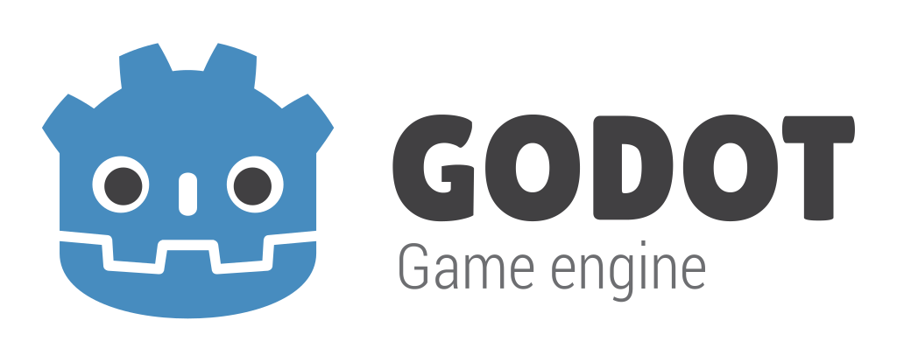

This is my personal repository for learning Godot & GDScript. I am not affiliated with the Godot Foundation or any other individuals/organizations mentioned in this repository.

# Learning Godot & GDScript

## Table of Contents

- [Learning Godot \& GDScript](#learning-godot--gdscript)
  - [Table of Contents](#table-of-contents)
  - [Understand the Basics of Game Development](#understand-the-basics-of-game-development)
  - [Set Up Godot](#set-up-godot)
  - [Resources](#resources)
  - [Learn GDScript](#learn-gdscript)
  - [Work on Small Projects](#work-on-small-projects)
  - [Explore Godot's Features](#explore-godots-features)
  - [Join the Community](#join-the-community)
  - [Expand Your Knowledge](#expand-your-knowledge)
  - [Work on Larger Projects](#work-on-larger-projects)
  - [Build a Complete Game](#build-a-complete-game)
  - [Keep Learning and Iterating](#keep-learning-and-iterating)

Learning the Godot game engine and GDScript can be an exciting and rewarding experience, especially if you are interested in game development. Here’s a structured approach to help you get started:

## Understand the Basics of Game Development

- **Game Design Principles:** Learn basic game design concepts, such as game loops, physics, AI, and UI/UX design.
Programming Basics: If you are new to programming, consider starting with a beginner-friendly language like Python, which will help you understand GDScript more easily.

## Set Up Godot

- **Download Godot:** Get the latest stable version of Godot from the [official website.](https://godotengine.org/). You can also find the Godot documentation there.

- **Explore the Interface:** Familiarize yourself with Godot's user interface. Understand the main sections: Scene Tree, Inspector, FileSystem, and Output console.

## Resources

- **Books:** Consider reading books like "Godot Engine Game Development Projects" by Chris Bradfield or "Godot Engine Game Development in 24 Hours" by Ariel Manzur.

- **YouTube Channels:** Follow channels like [GDQuest](https://www.youtube.com/@Gdquest), [HeartBeast](https://www.youtube.com/@uheartbeast), and [Game Endeavor](https://www.youtube.com/@GameEndeavor) for video tutorials.

- **Online Courses:** Platforms like [Udemy](https://www.udemy.com/courses/search/?src=ukw&q=godot) offer structured courses on Godot. These courses usually are not free though, so only buy them if you deem the price worth it.

## Learn GDScript

**Syntax and Structure:** GDScript is inspired by Python, so understanding Python’s structure can be helpful. GDScript is not based on Python though, so differences between the two will occur. Focus on:

- **Official Documentation:** Use the **Godot official documentation** as your primary resource. The ["Your First 2D Game"](https://docs.godotengine.org/en/stable/getting_started/first_2d_game/index.html) or ["Your First 3D Game"](https://docs.godotengine.org/en/stable/getting_started/first_3d_game/index.html) tutorials are great places to start.

- **Variables and Data Types:** Learn about integers, floats, strings, arrays, dictionaries, etc.

- **Functions:** Understand how to define and call functions, as well as using built-in functions.

- **Control Flow:** Study if-else statements, loops (for, while), and match statements (similar to switch-case).

- **Classes and Objects:** Learn how to define classes, create objects, and use inheritance and composition.

- **Practice with Simple Scripts:** Write small scripts to control nodes in Godot, such as moving a character or triggering an event on button press. Practice is key to mastering any programming language.

- **Practice Simple Scripts:** Write simple scripts to get familiar with variables, functions, loops, and conditionals in GDScript.

## Work on Small Projects

- **Start Small:** Begin with simple projects like a 2D platformer, a basic puzzle game, or a simple shooter. This will help you apply what you’ve learned in a practical context.

- **Incremental Learning:** As you build small projects, gradually introduce more complex elements like physics, shaders, and AI.

- **Use Tutorials:** Follow along with step-by-step tutorials. The official Godot tutorials and YouTube channels are great resources.

## Explore Godot's Features

- **Nodes and Scenes:** Learn how nodes work and how scenes are structured in Godot. Experiment with different node types (e.g., Sprite, KinematicBody2D, Camera2D).

- **2D vs 3D Development:** Godot supports both 2D and 3D game development. Start with 2D if you’re new to game dev, as it’s generally simpler.

- **2D Development:** Learn about the 2D node types (e.g., Sprite, TileMap, KinematicBody2D) and how to use them.

- **3D Development:** Understand the basics of 3D in Godot, including nodes like MeshInstance, Spatial, and Camera.

- **Signals and Scene System:** Learn how Godot’s scene system works, how to create reusable scenes, and how to use signals for communication between nodes.

- **Animation:** Experiment with Godot’s animation tools, such as the AnimationPlayer node, to create character animations and cutscenes.

- **Physics and Collision:** Learn about physics bodies (StaticBody2D, RigidBody2D, KinematicBody2D) and how to handle collisions.

## Join the Community

- **Forums and Discord:** Join the [Godot forums](https://godotforums.org/) and the Godot Engine Discord server to ask questions, share your work, and get feedback.

- **Reddit and Social Media:** Engage with the Godot community on platforms like [Reddit’s r/godot](https://www.reddit.com/r/godot/) or [Twitter](https://twitter.com/godotengine) to stay updated and connect with other developers.

- **Contribute to Open Source Projects:** If you feel confident, contribute to [open-source Godot projects on GitHub](https://github.com/search?q=godot&type=repositories). This is a great way to learn from experienced developers.

## Expand Your Knowledge

- **Advanced Tutorials:** Once comfortable, explore advanced topics like shaders, networking, or custom tools. Resources like GDQuest offer advanced tutorials and courses.

- **Documentation Deep Dive:** Spend time reading through the Godot documentation, especially the more advanced sections like the Godot API.

- **Experiment with Plugins:** Explore and use community-made plugins available on the Godot Asset Library

## Work on Larger Projects

- **Expand Your Projects:** Gradually take on more complex projects as you become comfortable with the basics. For example, move from a simple 2D platformer to a top-down RPG or a simple 3D game.

- **Game Jams:** Participate in game jams (such as the [Godot Wild Jam](https://godotwildjam.com/)) to challenge yourself with deadlines and specific themes. This is a great way to push your skills further.

## Build a Complete Game

- **Plan a Full Game Project:** After gaining experience, plan and develop a complete game. This could be a simple game released on itch.io or a more ambitious project.

- **Iterate and Improve:** Use feedback from players to improve your game. Consider adding more features, polishing the gameplay, and fixing bugs.

- **Publish Your Game:** Learn how to export your game to different platforms (PC, mobile, web) and publish it.

## Keep Learning and Iterating

- **Explore Advanced Topics:** Once you’re comfortable with the basics, dive into more advanced topics like shaders, 3D graphics, multiplayer networking, and optimization techniques.

- **Refactor and Optimize:** As you gain more experience, revisit your old projects to refactor and optimize your code and assets.

- **Stay Updated:** Follow Godot’s development and stay updated with new features and best practices by reading the changelogs and dev blogs.
